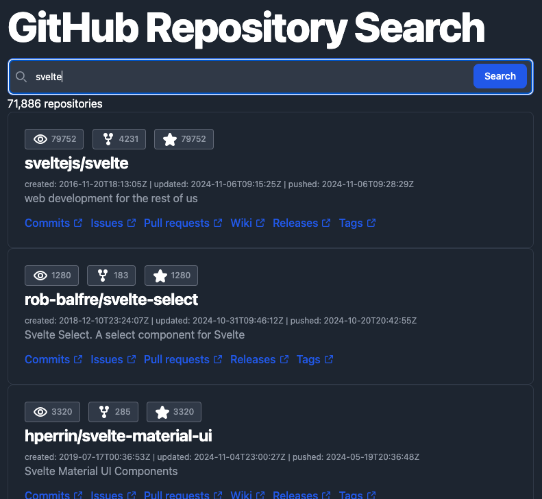

# svelte5-single-page-application

このリポジトリーは、技術書典17「[いまからはじめる Svelte 5](https://techbookfest.org/product/geNC4S5LANeb94wrP9uYd7?productVariantID=7eSJuv79asBgtNQ1A6MVqe)」付録のサンプルコードです。

* サイト全体にCSSを適用する
* Web APIを使う
* コンポーネントにアクションを取り付ける
* Vitestでユニットテストを実行する
* Storybookでコンポーネントテストを実行する
* Lintツールで静的解析する



## サンプルコードの試しかた

リポジトリーをクローンしたら、npmパッケージをインストールします。

```bash
cd svelte5-single-page-application
npm ci
```

そして、[Vite](https://vite.dev/)のモジュール・バンドル処理を実行し...

```bash
npm run dev
```

ウェブブラウザーで[localhost:5173](http://localhost:5173)にアクセスします。

## 開発環境

* [Svelte](https://svelte.dev) v5.x
* [svelte-check](https://www.npmjs.com/package/svelte-check) v4.x
* [Biome](https://biomejs.dev/ja/) v1.x
* [TypeScript](https://www.typescriptlang.org/) v5.x
* [Vitest](https://vitest.dev/) v2.x
* [Vite](https://vite.dev) v5.x
* [Tailwind CSS](https://tailwindcss.com/) v3.x

## 開発の進めかた

コードを書き換えたら、Lintツール（svelte-check・Biome）で静的解析します。

```bash
npm run validate
npm run lint
```

もしBiomeがエラーを報告したら...

```bash
npm run fix
```

エラーを解消できたら、ユニットテスト（Vitest）を実行します。

```bash
npm run test
```
